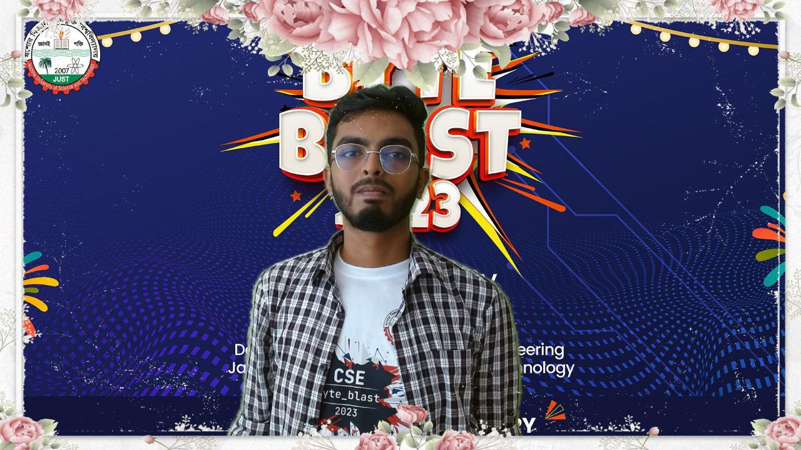
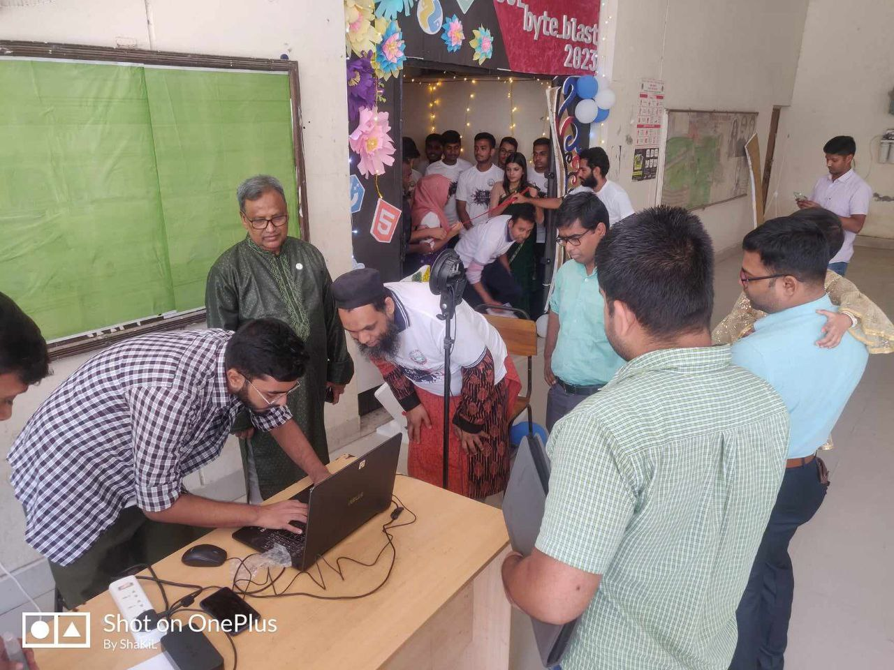
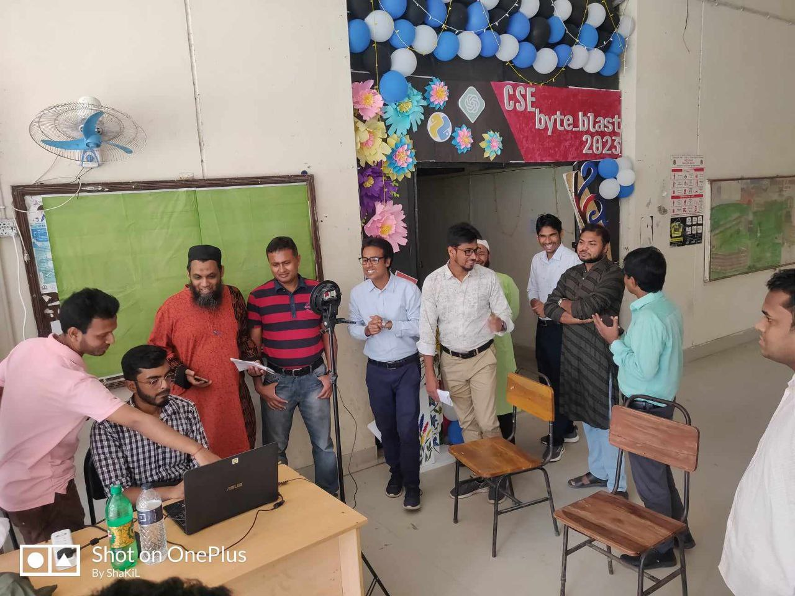

# Virtual Photo Booth (BASNet)

A lightweight virtual photo studio that performs high-quality background removal using BASNet (Boundary-Aware Segmentation Network) and composes portraits with themed frames and backdrops. Perfect for event photography, professional headshots, and quick social media content creation.

## Overview

This project demonstrates an automated pipeline for creating professional-looking photos with custom backgrounds and frames. Originally developed for campus events, it uses deep learning to extract subjects with crisp edges and seamlessly composite them onto themed backgrounds.

### Key Features

- **High-Quality Segmentation**: Uses BASNet for precise foreground extraction with clean boundaries
- **Themed Compositions**: Automatically applies custom frames and backgrounds
- **Event-Ready**: Designed for quick turnaround during live events
- **Flexible Pipeline**: Easy to adapt for different themes and branding requirements

## Sample Results

Below are examples from a CSE department event demonstrating the system's capabilities:

<table>
<tr>
<td width="50%">

### CSE ByteBlast Event Photo

  

Background removed and themed frame applied with event branding.

</td>
<td width="50%">

### Custom Framed Portrait

  

Clean background separation with decorative frame.

</td>
</tr>

<tr>
<td width="50%">

### Vice Chancellor Portrait

  

Professional composition with themed background.

</td>
<td width="50%">

### Department Faculty Visit

  

Group photo with custom background and frame.

</td>
</tr>
</table>

## How It Works

The system processes photos in three stages:

1. **Segmentation**: BASNet analyzes the input image and generates a precise foreground mask
2. **Extraction**: The subject is cleanly separated from the original background
3. **Composition**: The extracted subject is composited onto a themed background with optional frames

## Repository Structure

- `test_test.py` — Main entry point running the BASNet-powered pipeline (current version)
- `merged.py` — Combined utilities and helper functions for the pipeline
- `test.py` — Legacy prototype retained for reference
- `data_loader.py` — Asset preparation helper for first-time setup
- `saved_model/basnet/basnet.pth` — Pre-trained BASNet weights (download separately)
- `Images/` — Sample output images showcased above

## Setup Instructions

### Prerequisites

- Python 3.7 or higher
- CUDA-compatible GPU (recommended for faster processing)

### Installation Steps

1. Clone this repository
2. Create and activate a Python virtual environment
3. Install required dependencies:
4. Download the pre-trained BASNet model weights from [BASNet official repository](https://github.com/xuebinqin/BASNet)
5. Place `basnet.pth` in the `saved_model/basnet/` directory

### Running the Application

	python test_test.py

The script will process images from the input directory and save composited results to the output folder.

## Use Cases

- **Campus Events**: Quickly generate branded photos during student activities
- **Professional Photography**: Create consistent headshots with uniform backgrounds
- **Social Media Content**: Prepare eye-catching profile pictures and posts
- **Marketing Materials**: Generate promotional images with brand-consistent styling

## Technical Details

**BASNet Architecture**: The Boundary-Aware Segmentation Network combines a predict-refine strategy with residual refinement modules to achieve state-of-the-art accuracy in salient object detection, making it ideal for portrait segmentation tasks.

## Future Enhancements

- Real-time processing for live photo booth setups
- Additional frame and background templates
- Batch processing interface for large event galleries
- Mobile application integration

## Acknowledgments

This project builds upon the BASNet implementation by Qin et al. Special thanks to the CSE department for supporting this initiative during campus events.

---

For questions or collaboration opportunities, feel free to reach out through GitHub issues.

